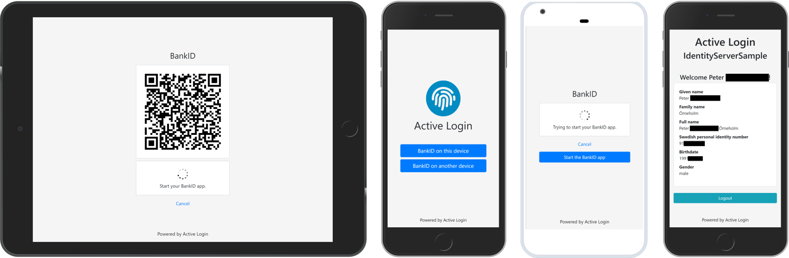
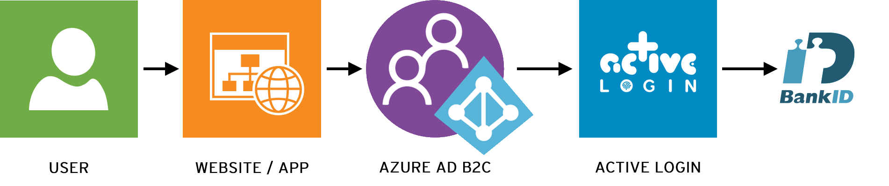

# ActiveLogin.Authentication

[](https://opensource.org/licenses/MIT)
[](https://dev.azure.com/activesolution/ActiveLogin/_build/latest?definitionId=192&branchName=master)
[](https://al-samples-mvcclient.azurewebsites.net/)
[](https://join.slack.com/t/activelogin/shared_invite/enQtODQ0ODYyMTgxMjg0LWJhODhiZmFmODYyMWMzZWEwMjdmYWU2NGRhZmQ0MTg0MzIwNzA2OTM3NTJjOTk2MmE1MzIwMzkzYjllMjAyNzg)
[](https://twitter.com/ActiveLoginSE)

ActiveLogin.Authentication enables an application to support Swedish BankID (svenskt BankID) authentication in .NET. Built on NET Standard and packaged as NuGet-packages they are easy to install and use on multiple platforms. Used with Identity Server it can be configured as a provider for Azure AD B2C. Free to use, [commercial support and training](#support--training) is available if you need assistance or a quick start. 

## Features

- :id: Supports BankID both natively and through GrandID
- :penguin: Cross platform: Targets .NET Standard 2.0 and .NET Core 3.1
- :five: Built on V5 (the latest) BankID JSON API released in February 2018
- :white_square_button: Supports BankID QR code and Cancel
- :lock: GDPR: Security by design
- :cloud: Designed with Microsoft Azure in mind (KeyVault, Monitor, Application Insights, AD B2C etc.)
- :earth_americas: Multi language support with English and Swedish out of the box
- :wrench: Customizable UI
- :diamond_shape_with_a_dot_inside: Can be used as a [Custom Identity Provider for Azure AD B2C](#how-do-i-use-active-login-to-get-support-for-bankid-or-grandid-in-azure-ad-active-directory-b2c)

## Screenshots

_Screenshots on how the default UI for Native BankID looks on different devices._



## Table of contents
* [Project & Packages overview](#project--packages-overview)
	+ [ActiveLogin.Authentication.BankId.*](#activeloginauthenticationbankid)
	+ [ActiveLogin.Authentication.GrandId.*](#activeloginauthenticationgrandid)
* [Getting started](#getting-started)
	+ [1. Read the documentation](#1-read-the-documentation)
	+ [2. Install the NuGet package](#2-install-the-nuget-package)
	+ [3. Prepare your project](#3-prepare-your-project)
	+ [4. Get started in development](#4-get-started-in-development)
	+ [5. Use test or production environments](#5-use-test-or-production-environments)
* [Samples](#samples)
	+ [Projects and live demos](#projects-and-live-demos)
	+ [Tests](#tests)
* [FAQ](#faq)
	+ [What version of .NET is supported?](#what-version-of-net-is-supported)
	+ [How do I build the solution locally?](#how-do-i-build-the-solution-locally)
	+ [How do I run the samples locally?](#how-do-i-run-the-samples-locally)
	+ [How do I override the default UI?](#how-do-i-override-the-default-ui)
	+ [How do I use Active Login to get support for BankID or GrandID in Azure AD (Active Directory) B2C?](#how-do-i-use-active-login-to-get-support-for-bankid-or-grandid-in-azure-ad-active-directory-b2c)
	+ [How do I prepopulate the personal identity number for the user?](#how-do-i-prepopulate-the-personal-identity-number-for-the-user)
	+ [Do I need to use your ASP.NET Core Auth provider, or can just use the API?](#do-i-need-to-use-your-aspnet-core-auth-provider--or-can-just-use-the-api)
	+ [Do Active Login Issue any cookies?](#do-active-login-issue-any-cookies)
	+ [What browsers do you support?](#what-browsers-do-you-support)
    + [What dependencies do I need if I run Active Login on Linux or in a Linux Docker container?](#what-dependencies-do-i-need-if-i-run-active-login-on-linux-or-in-a-linux-docker-container)
	+ [Why are the names of the person sometimes capitalized?](#why-are-the-names-of-the-person-sometimes-capitalized)
* [Active Login](#active-login)
	+ [Contribute](#contribute)
	+ [Stay updated and join the discussion](#stay-updated-and-join-the-discussion)
	+ [License & acknowledgements](#license--acknowledgements)
	+ [Sponsors](#sponsors)
	+ [Support & Training](#support--training)

## Project & Packages overview

CI-builds from master of all packages are available in [our Azure DevOps Artifacts feed](https://dev.azure.com/activesolution/ActiveLogin/_packaging?_a=feed&feed=ActiveLogin-CI).

### ActiveLogin.Authentication.BankId.*

Packages for Swedish BankID.

| Project | Description | NuGet | Downloads |
| ------- | ----------- | ----  | --------- |
| [BankId.Api](https://github.com/ActiveLogin/ActiveLogin.Authentication/tree/master/src/ActiveLogin.Authentication.BankId.Api) | API client for the Swedish BankID REST API. | [](https://www.nuget.org/packages/ActiveLogin.Authentication.BankId.Api/) | [](https://www.nuget.org/packages/ActiveLogin.Authentication.BankId.Api/) |
| [BankId.AspNetCore](https://github.com/ActiveLogin/ActiveLogin.Authentication/tree/master/src/ActiveLogin.Authentication.BankId.AspNetCore) | ASP.NET Core authentication module for Swedish BankID. | [](https://www.nuget.org/packages/ActiveLogin.Authentication.BankId.AspNetCore/) | [](https://www.nuget.org/packages/ActiveLogin.Authentication.BankId.AspNetCore/) |
| [BankId.AspNetCore.Azure](https://github.com/ActiveLogin/ActiveLogin.Authentication/tree/master/src/ActiveLogin.Authentication.BankId.AspNetCore.Azure) | Azure integrations for the AspNetCore package. | [](https://www.nuget.org/packages/ActiveLogin.Authentication.BankId.AspNetCore.Azure/) | [](https://www.nuget.org/packages/ActiveLogin.Authentication.BankId.AspNetCore.Azure/) |
| [BankId.AspNetCore.QRCoder](https://github.com/ActiveLogin/ActiveLogin.Authentication/tree/master/src/ActiveLogin.Authentication.BankId.AspNetCore.QRCoder) | QR code generation using QRCoder the AspNetCore package. | [](https://www.nuget.org/packages/ActiveLogin.Authentication.BankId.AspNetCore.QRCoder/) | [](https://www.nuget.org/packages/ActiveLogin.Authentication.BankId.AspNetCore.QRCoder/) |

### ActiveLogin.Authentication.GrandId.*

Packages for GrandID (Svensk E-identitet).

| Project | Description | NuGet | Downloads |
| ------- | ----------- | ----- | --------- |
| [GrandId.Api](https://github.com/ActiveLogin/ActiveLogin.Authentication/tree/master/src/ActiveLogin.Authentication.GrandId.Api) | API client for the GrandID (Svensk E-identitet) REST API. | [](https://www.nuget.org/packages/ActiveLogin.Authentication.GrandId.Api/) | [](https://www.nuget.org/packages/ActiveLogin.Authentication.GrandId.Api/) |
| [GrandId.AspNetCore](https://github.com/ActiveLogin/ActiveLogin.Authentication/tree/master/src/ActiveLogin.Authentication.GrandId.AspNetCore) | ASP.NET Core authentication module for GrandID (Svensk E-identitet). | [](https://www.nuget.org/packages/ActiveLogin.Authentication.GrandId.AspNetCore/) | [](https://www.nuget.org/packages/ActiveLogin.Authentication.GrandId.AspNetCore/) |

## Getting started

First of all, you need to decide if you want to use [native BankID](https://www.bankid.com/bankid-i-dina-tjanster/sa-kommer-du-igang) or BankID through [GrandID (Svensk E-identitet)](https://e-identitet.se/tjanster/inloggningsmetoder/bankid/).

* _Native BankID_ gives you full flexibility, including custom UI but requires issuing a certificate through a bank and usually takes some time to sort out.
* _GrandID (Svensk E-identitet)_ uses a predefined UI and does not support all functionalities of the BankID API, but is really easy to get started with and does not require any certificates.

### 1. Read the documentation

Active Login is designed to make it very easy to get started with BankID and GrandID (Svensk E-identitet), but in the end you are resonsible for making sure that you are complient with the technical guidelines and/or legal agreements.
Therefore, before you start using Active Login, please read the documentation relevant to your needs. This will also make sure you understand the concepts better.

- [BankID - Teknisk information (Swedish)](https://www.bankid.com/bankid-i-dina-tjanster/rp-info)
- [Svensk E-identitet - BankID (English)](https://docs.grandid.com/bankid)

### 2. Install the NuGet package

ActiveLogin.Authentication is distributed as [packages on NuGet](https://www.nuget.org/profiles/ActiveLogin), install using the tool of your choice, for example _dotnet cli_.

#### BankID

```console
dotnet add package ActiveLogin.Authentication.BankId.AspNetCore
```

#### GrandID

```console
dotnet add package ActiveLogin.Authentication.GrandId.AspNetCore
```

### 3. Prepare your project

It is expected that you have a basic understanding of how [ASP.NET Core](https://docs.microsoft.com/en-us/aspnet/core/), [ASP.NET Core MVC](https://docs.microsoft.com/en-us/aspnet/core/mvc/overview) and [ASP.NET Core Authentication](https://docs.microsoft.com/en-us/aspnet/core/security/authentication/identity) works before getting started.

Also, you are expected to have read up on the [latest information from BankID](https://www.bankid.com/bankid-i-dina-tjanster/rp-info). Active Login will help you to implement BankID according to guidelines, but in the end, it's your responsiblity to follow the BankID agreement.

The authentication modules for BankID and GrandID are registered in `ConfigureServices( ... )` in your `Startup.cs`. Depending on your setup, you will probably have to configure challenge and callbacks in `AccountController.cs` or similar.

### 4. Get started in development

Both BankID and GrandID requires you to receive either certificates or API-keys, but to get started and try it out the experience there is a simulated environment options available that uses an in-memory implementation. Great for development and testing.

#### BankID

```csharp
services
    .AddAuthentication()
    .AddBankId(builder =>
    {
        builder
            .UseSimulatedEnvironment()
            .AddSameDevice();
    });
```

#### GrandID

```csharp
services
    .AddAuthentication()
    .AddGrandId(builder =>
    {
        builder
            .UseSimulatedEnvironment()
            .AddBankIdSameDevice(options => { })
            .AddBankIdOtherDevice(options => { });
    });
```

#### Routes

Also make sure that you map the controller route in ASP.NET Endpoint routing, like this:

```csharp
app.UseEndpoints(endpoints =>
{
    endpoints.MapDefaultControllerRoute();
});
```

### 5. Use test or production environments

To authenticate using a real BankID you need to receive a certificate or API-keys, depending on what solution you choose. The details are described in these documents:

* [Getting started with BankID in Test and Production](docs/getting-started-bankid.md)
* [Getting started with GrandID in Test and Production](docs/getting-started-grandid-bankid.md)

Samples on how to use them in production are:

#### [BankID](docs/getting-started-bankid.md)

```csharp
services
    .AddAuthentication()
    .AddBankId(builder =>
    {
        builder
            .UseProductionEnvironment()
            .UseClientCertificateFromAzureKeyVault(Configuration.GetSection("ActiveLogin:BankId:ClientCertificate"))
            .UseRootCaCertificate(Path.Combine(_environment.ContentRootPath, Configuration.GetValue<string>("ActiveLogin:BankId:CaCertificate:FilePath")))
            .AddSameDevice()
            .AddOtherDevice()
            .UseQrCoderQrCodeGenerator();
    });
```

_Note: `.UseQrCoderQrCodeGenerator()` requires the [ActiveLogin.Authentication.BankId.AspNetCore.QRCoder](https://www.nuget.org/packages/ActiveLogin.Authentication.BankId.AspNetCore.QRCoder/) package._

#### [GrandID](docs/getting-started-grandid-bankid.md)

```csharp
services
    .AddAuthentication()
    .AddGrandId(builder =>
    {
        builder
            .UseProductionEnvironment(config => {
                config.ApiKey = Configuration.GetValue<string>("ActiveLogin:GrandId:ApiKey");
                config.BankIdServiceKey = Configuration.GetValue<string>("ActiveLogin:GrandId:BankIdServiceKey");
            })
            .AddBankIdSameDevice()
            .AddBankIdOtherDevice();
    });
```

---

## Samples

For more use cases, samples and inspiration; feel free to browse our unit tests and samples.

_Note: These are samples on how to use Active Login in different situations and might not represent optimal way of setting up ASP.NET MVC, Identity Server or other components. Please see this as inspiration._

## Projects and live demos

Our samples are deployed with the latest version from master and available for you to try out:

| Project | Live demo | Description |
| ------- | --------- | ----------- |
| [IdentityServer.ClientSample](https://github.com/ActiveLogin/ActiveLogin.Authentication/tree/master/samples/IdentityServer.ClientSample) | [https://al-samples-mvcclient.azurewebsites.net](https://al-samples-mvcclient.azurewebsites.net) | ASP.NET MVC Core site using the IdentityServer.ServerSample as auth provider. |
| [IdentityServer.ServerSample](https://github.com/ActiveLogin/ActiveLogin.Authentication/tree/master/samples/IdentityServer.ServerSample) | [https://al-samples-identityserver.azurewebsites.net](https://al-samples-identityserver.azurewebsites.net) | IdentityServer with Active Login as auth provider for BankID and GrandID. |
| [Standalone.MvcSample](https://github.com/ActiveLogin/ActiveLogin.Authentication/tree/master/samples/Standalone.MvcSample) | Not available | ASP.NET MVC Core with Active Login as auth provider for BankID and GrandID. |
| [AzureProvisioningSample](https://github.com/ActiveLogin/ActiveLogin.Authentication/tree/master/samples/AzureProvisioningSample) | [](https://portal.azure.com/#create/Microsoft.Template/uri/https%3A%2F%2Fraw.githubusercontent.com%2FActiveLogin%2FActiveLogin.Authentication%2Fmaster%2Fsamples%2FAzureProvisioningSample%2FActiveLogin.json) | ARM template with Azure KeyVault, Azure App Service, Azure Monitor / Application Insights etc. |

_Please note that IdentityServer.ClientSample uses IdentityServer.ServerSample as the IdentityProvider, so the IdentityServer.ClientSample is a good place to start._

## Tests

* [BankId.Api.Test](https://github.com/ActiveLogin/ActiveLogin.Authentication/tree/master/test/ActiveLogin.Authentication.BankId.Api.Test)
* [BankId.AspNetCore.Test](https://github.com/ActiveLogin/ActiveLogin.Authentication/tree/master/test/ActiveLogin.Authentication.BankId.AspNetCore.TestActiveLogin.Authentication.BankId.Api.Test)
* [BankId.AspNetCore.Azure.Test](https://github.com/ActiveLogin/ActiveLogin.Authentication/tree/master/test/ActiveLogin.Authentication.BankId.AspNetCore.Azure.Test)
* [GrandId.Api.Test](https://github.com/ActiveLogin/ActiveLogin.Authentication/tree/master/test/ActiveLogin.Authentication.GrandId.Api.Test)
* [GrandId.AspNetCore.Azure.Test](https://github.com/ActiveLogin/ActiveLogin.Authentication/tree/master/test/ActiveLogin.Authentication.GrandId.AspNetCore.Azure.Test)

---

## FAQ

### What version of .NET is supported?

The API-wrappers (*.Api) target .NET Standard 2.0, so they can be used from .NET Core >= 2.0 and .NET Framework >= 4.6.1, [see full reference here](https://docs.microsoft.com/en-us/dotnet/standard/net-standard#net-implementation-support). The packages that target .NET Standard are strong named as they can be used from .NET Framework where strong naming can be relevant.

The authentication modules (*.AspNetCore), and related packages, depend on ASP.NET Core MVC 3.1 and therefore require .NET Core 3.1.

Our samples target .NET Core 3.1.

### How do I build the solution locally?

Active Login is built using .NET Core, make sure you have the relevant version of the SDK and runtime installed.

Run the following command in the root to build all projects:

```console
dotnet build
```

### How do I run the samples locally?

The samples are configured to run in simulated mode (no BankID certificates or GrandID keys required) by default. The _IdentityServer.ClientSample_ is using the _IdentityServer.ServerSample_ as its identity provider. So to run the _IdentityServer.ClientSample_, the _IdentityServer.ServerSample_ needs to be running first.

The easiest way to try the sample out is to:

1. Configure the solution to use _Multiple startup projects_, and set it to start both _IdentityServer.ServerSample_ and _IdentityServer.ClientSample_
1. Press F5

There is also a standalone sample called _Standalone.MvcSample_ which uses only AspNetCore MVC with minimum of code.

### How do I override the default UI?

Active Login comes with predefined views that you can use, but maybe you'd rather use your own views to customize layout or behavior.

In your web project, create the following folder:
```Areas/BankIdAuthentication/Views/BankId```

In this folder, you can then create any of the partials and MVC will then discover your partials and use any of them before ours. It's still possible to call our partials if you still want to use them.

* `_Login.cshtml`
* `_LoginForm.cshtml`
* `_LoginScript.cshtml`
* `_LoginStatus.cshtml`
* `_LoginStyle.cshtml`

See [the MVC sample](https://github.com/ActiveLogin/ActiveLogin.Authentication/tree/master/samples/Standalone.MvcSample) to see this in action, as demonstrated [here](https://github.com/ActiveLogin/ActiveLogin.Authentication/tree/master/samples/Standalone.MvcSample/Areas/BankIdAuthentication/Views/BankId/_Login.cshtml).

### How do I use Active Login to get support for BankID or GrandID in Azure AD (Active Directory) B2C?

Azure AD B2C supports using custom identity providers that supports [Open ID Connect](https://docs.microsoft.com/sv-se/azure/active-directory-b2c/active-directory-b2c-reference-oidc). If you deploy Active Login as part of Identity Server (see our samples) you can configure your Azure AD B2C to federate to that instance and by doing so get BankID and/or GrandID support.



Please [reach out](#support--training) if you need assistance in seting this up.

### How do I prepopulate the personal identity number for the user?

For legacy reasons, we do support this. But note that the recomendation from BankID is to notuse personal identity numbers, but rather launch the BankID app on the same device or use QR-codes. This is the default behaviour for Active Login.

If you have a usecase for this, you provide an authentication property item named `swedishPersonalIdentityNumber` (available as constants `BankIdConstants.AuthenticationPropertyItemSwedishPersonalIdentityNumber` or `GrandIdConstants.AuthenticationPropertyItemSwedishPersonalIdentityNumber`) that value will be used and sent to BankID/GrandID.

_Example usage:_

```csharp
public IActionResult ExternalLogin(string provider, string returnUrl, string personalIdentityNumber)
{
    var props = new AuthenticationProperties
    {
        RedirectUri = Url.Action(nameof(ExternalLoginCallback)),
        Items =
        {
            { "returnUrl", returnUrl },
            { "scheme", provider },
            { BankIdConstants.AuthenticationPropertyItemSwedishPersonalIdentityNumber, personalIdentityNumber }
        }
    };

    return Challenge(props, provider);
}
```

### Do I need to use your ASP.NET Core Auth provider, or can just use the API?

We have seperated the API-wrappers for both BankID and GrandID into two separate packages so that you can use them in other scenarios we have not covered. They look like this and are both well documented using XML-comments.

The constructor for these ApiClients takes an `HttpClient` and you need to configure that `HttpClient` with a `BaseAddress`, `Tls12`, client certificates etc. depending on your needs.

#### ActiveLogin.Authentication.BankId.Api

```csharp
public class BankIdApiClient : IBankIdApiClient
{
    public Task<AuthResponse> AuthAsync(AuthRequest request) { ... }
    public Task<SignResponse> SignAsync(SignRequest request) { ... }
    public Task<CollectResponse> CollectAsync(CollectRequest request) { ... }
    public Task<CancelResponse> CancelAsync(CancelRequest request) { ... }
}
```

#### ActiveLogin.Authentication.GrandId.Api

```csharp
public class GrandIdApiClient : IGrandIdApiClient
{
    public async Task<BankIdFederatedLoginResponse> BankIdFederatedLoginAsync(BankIdFederatedLoginRequest request) { ... }
    public async Task<BankIdGetSessionResponse> BankIdGetSessionAsync(BankIdGetSessionRequest request) { ... }
    public async Task<LogoutResponse> LogoutAsync(LogoutRequest request) { ... }
}
```

### Do Active Login Issue any cookies?

Yes, the `*.AspNetCore` packages will issue cookies to make the auth flow work.

The cookies are called:

- BankId: `__ActiveLogin.BankIdState`
- GrandId: `__ActiveLogin.GrandIdState`

The cookies are there to store state during the auth process, as the user will/might be redirected during the flow. The cookies are session based only and will be deleted once the auth process is finished and/or when the user closes the browser.

Because they are strictly related to temp storage during auth, you should not have to inform the user about these specific cookies (according to the [EU "cookie law"](https://www.cookielaw.org/the-cookie-law/)).

With the current implementaiton (following the convention from Microsoft ASP.NET Core) the usage of cookies is not optional.

A more technical deep dive of the cookies can be found in [this issue](https://github.com/ActiveLogin/ActiveLogin.Authentication/issues/156).

### What browsers do you support?

We aim at supporting the latest version of all major browsers (Edge, Chrome, Firefox, Safari) both on desktop and on mobile.

All browsers on mobile are supported, but the full automated flow on same device (redirect between apps) are supported on these:
- Safari on iOS
- Chrome on iOS
- Firefox on iOS
- All browsers on Android

If you aim to support IE11 a polyfill for some JavaScript features we are using is needed.

* [Fetch](https://developer.mozilla.org/en-US/docs/Web/API/Fetch_API): https://github.com/github/fetch

### What dependencies do I need if I run Active Login on Linux or in a Linux Docker container?

The ActiveLogin.Authentication.BankId.AspNetCore.QRCoder package has a dependency on package `libgdiplus` on Linux.

If you are using Active Login with BankID QR-Codes on either WSL (Windows Subsystem for Linux) or in a Linux Docker Container your OS must have this package installed.

Add `libgdiplus` to your Dockerfile using apt-get.
```dockerfile
FROM mcr.microsoft.com/dotnet/core/aspnet:3.1 AS base
RUN apt-get update && apt-get -y install libgdiplus libc6-dev
...
```

### Why are the names of the person sometimes capitalized?

The names comes from the bank that the end user has, and some banks (due to legacy) stores all of the names in all caps (like `ALICE SMITH`).

We have choosen not to normalize the capitalization of the names as it´s hard or impossible to do so in a general way.

---

## Active Login

_Integrating your systems with market leading authentication services._

Active Login is an Open Source project built on .NET Core that makes it easy to integrate with leading Swedish authentication services like [BankID](https://www.bankid.com/).

It also provide examples of how to use it with the popular OpenID Connect & OAuth 2.0 Framework [IdentityServer](https://identityserver.io/) and provides a template for hosting the solution in Microsoft Azure.

In addition, Active Login also contain convenient modules that help you work with and handle validation of Swedish Personal Identity Number (svenskt personnummer).

### Contribute

We are very open to community contributions to Active Login.
Please see our [contribution guidelines](CONTRIBUTING.md) before getting started.

### Stay updated and join the discussion

The three primary ways to interact and stay updated with Active Login are:

- [Watch our GitHub repo](https://github.com/ActiveLogin/ActiveLogin.Authentication/watchers)
- [Slack](https://join.slack.com/t/activelogin/shared_invite/enQtODQ0ODYyMTgxMjg0LWJhODhiZmFmODYyMWMzZWEwMjdmYWU2NGRhZmQ0MTg0MzIwNzA2OTM3NTJjOTk2MmE1MzIwMzkzYjllMjAyNzg)
- [Twitter](https://twitter.com/ActiveLoginSE)

### License & acknowledgements

Active Login is licensed under the very permissive [MIT license](https://opensource.org/licenses/MIT) for you to be able to use it in commercial or non-commercial applications without many restrictions.

Active Login is built on or uses the following great open source products:

* [.NET Core](https://github.com/dotnet/core)
* [ASP.NET Core](https://github.com/aspnet/Home)
* [IdentityServer](https://github.com/IdentityServer/)
* [XUnit](https://github.com/xunit/xunit)
* [QRCoder](https://github.com/codebude/QRCoder)
* [Bootstrap](https://github.com/twbs/bootstrap)
* [Loading.io](https://loading.io/)

### Sponsors

Active Solution is the main sponsor of Active Login. Active Solution is located in Stockholm (Sweden) and provides IT consulting with focus on web, cloud and AI.


_We deliver tomorrow's cloud solutions, today. Our costumers choose us because we are engaged, flexible and efficient. We attract the brightest talent and are one of Microsoft's most valued partners._

[https://www.activesolution.se/](https://www.activesolution.se/)

### Support & Training

If you need help with implementing Active Login, there are commercial support & training options available.

We can help you out with:

- Education and training on:
	- Active Login
	- Identity Server
	- Azure AD B2C
	- Authentication on the .NET platform in general
- Hands on implementing BankID using Active Login
- Implement BankID as a custom Identity Provider for Azure AD B2C
- Continuous support for Active Login

See [ActiveLogin.net](https://activelogin.net#support) for more details on how to get in touch with us.
